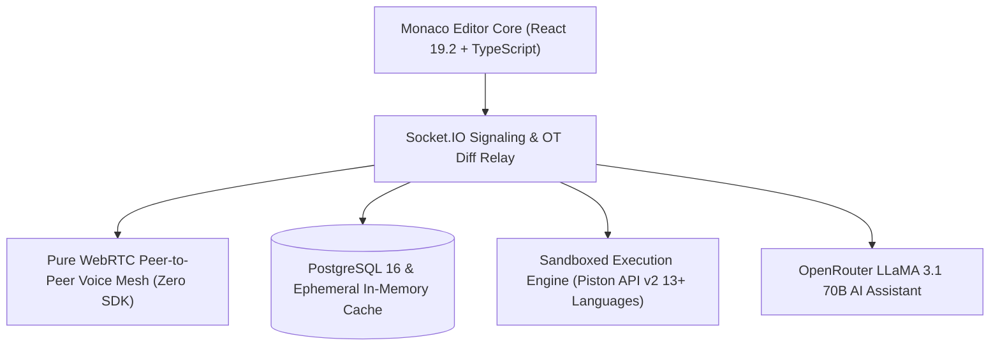
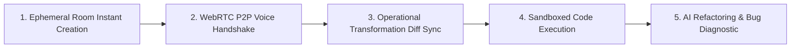

# ⚡ GOAT Code Editor (GOAT CE) — Real-Time Collaborative IDE with WebRTC Voice & AI
### *High-Performance In-Browser IDE with Pure WebRTC Voice Mesh, Operational Transformation, Monaco Kernel & 13+ Languages*

   [-007ACC?style=for-the-badge&logo=visualstudiocode&logoColor=white)](#) [-339933?style=for-the-badge&logo=webrtc&logoColor=white)](#)  

  <a href="https://github.com/Tharun4743/GOAT-CE">📦 <b>Official GitHub Repository</b></a>
  • <a href="https://goatcode-editor.onrender.com">🌐 <b>Production Live Demo</b></a>
  

---

## 1. 📌 Problem Statement & Context
Engineers conducting technical interviews, pair programming, or hackathons face software fragmentation:

* 🔀 **Disjointed Audio & Code:** Developers juggle multiple tools (VS Code, Zoom/Discord, terminals), fragmenting focus.
* 💥 **Caret Overwrite Clashes:** Multiple users editing concurrently experience race conditions and desynchronized buffers.
* 💾 **Bloated Desktop Prerequisites:** Conventional environments require downloading heavy IDEs and compiler toolchains.
* 🔒 **Telemetry & Privacy Risks:** Commercial pair programming tools route proprietary code through third-party servers.

---

## 2. 🔍 Existing Solutions & Critical Gaps
| Feature / Metric | VS Code Live Share | Cloud Containers (Replit) | ⚡ GOAT Code Editor (GOAT CE) |
| :--- | :---: | :---: | :---: |
| **Integrated Voice Calling** | ❌ Requires Discord/Teams | ❌ None | ✅ Pure WebRTC P2P Voice (Zero SDK) |
| **Startup / Onboarding Time** | ⚠️ 3–5 Minutes Setup | ⚠️ 20–45s Container Spinup | ✅ Instant (<2 Seconds via Room URL) |
| **Multi-User Collaboration Cost** | ⚠️ Requires Microsoft Account | 💸 Paid Monthly Subscription | ✅ 100% Free & Unlimited |
| **Third-Party Audio SDK Dependency** | ❌ N/A | ❌ N/A | ✅ Zero SDKs (Pure WebRTC Implementation) |
| **Multi-Language Sandbox** | ⚠️ Dependent on Host Machine | ⚠️ Heavyweight Virtual Machines | ✅ 13+ Languages via Piston API |

### ⚠️ Critical Limitations of Existing Alternatives:
* 🚫 **Audio Fragmentation:** Lack of native browser voice requires tab-switching to external meeting applications.
* 🛑 **Heavy Container Boot Times:** Virtualizing entire OS machines introduces 20–45s spinup delays and high memory usage.
* 💸 **Aggressive Paywalls:** Leading collaborative IDEs restrict real-time multiplayer features behind recurring fees.

---

## 3. 💡 Proposed Solution & Architectural Innovation
**GOAT Code Editor (GOAT CE)** is a browser-native collaborative workspace uniting sync, voice, sandboxing, and AI:

* 🎙️ **Pure WebRTC Voice Mesh (Zero SDKs):** Signaling architecture managing SDP handshakes, ICE relays, encrypted audio, and VAD.
* 📝 **Sub-Pixel Operational Transformation:** Real-time diff streaming broadcasting cursor positions, user colors, and typing status.
* ⚙️ **13+ Language Sandboxed Execution:** Multi-language compiler running JS, TS, Python, Java, C++, Go, and Rust via Piston API v2.
* 🤖 **Integrated OpenRouter AI Assistant:** Embedded LLaMA 3.1 70B AI panel for instant algorithmic refactoring and bug diagnosis.
* ⚡ **Ephemeral Dual-Persistence Engine:** Persistent room states stored in PostgreSQL 16 with in-memory fallback cache.

---

## 4. ⚙️ Technical Approach & System Architecture

### 📐 High-Level Architectural Flowchart:

| System Subsystem | Technologies Used | Functional Purpose |
| :--- | :--- | :--- |
| **Editor Front-End** | React 19.2, TypeScript, Monaco Editor | Full Monaco VS Code core, Fira Code typography, light/dark themes |
| **Real-Time Data Sync** | Socket.io 4.8 | Operational transformation code diff streaming, remote cursor sync |
| **Voice Streaming** | WebRTC RTCPeerConnection, Web Audio | P2P encrypted voice mesh, AnalyserNode VAD, hardware echo cancellation |
| **Backend Server** | Express 5.2, Node.js | WebRTC signaling hub, room lifecycle controller, and automated cleanup |
| **Persistence Engine** | PostgreSQL 16, In-Memory Map | Dual-persistence engine: relational storage with auto-fallback to RAM |
| **Code Runner & AI** | Piston API, OpenRouter LLaMA 3.1 | Multi-language sandbox execution; theme-aware console and AI panel |

### 🔄 End-to-End Operational Lifecycle Workflow:

1. **Workspace Spinup:** User creates or joins room via unique URL → Monaco Editor loads with selected language boilerplate.
2. **Real-Time Pairing:** Remote peer joins → Socket.io initiates code sync and cursor broadcasting → WebRTC negotiates P2P encrypted voice.
3. **Execution & AI Review:** User runs code via Piston API → Output streams to console → OpenRouter AI analyzes edge-case bugs and suggests fixes.

---

## 5. 📈 Quantifiable Impact & Measurable Benefits
* 🥇 **1st Place Winner at Code Thugs 2k26:** Awarded top national honors for architectural innovation and zero-SDK WebRTC implementation.
* 🌐 **Production Live Deployment:** Actively serving developers at goatcode-editor.onrender.com with global availability.
* 💰 **Zero VoIP Infrastructure Costs:** Eliminated 100% of third-party voice SDK fees by building the WebRTC signaling engine from scratch.
* ⏱️ **Sub-2-Second Onboarding:** Developers start a collaborative coding and voice session with zero installation or configuration.

---

## 6. 🚀 Feasibility, Operational Viability & Scalability
* 🔬 **Technical Feasibility:** P2P voice mesh transmits audio directly between browsers, reducing server bandwidth to mere kilobytes of signaling metadata.
* 💰 **Economic & Financial Viability:** Automatic room garbage collection purges inactive workspaces, allowing hundreds of concurrent rooms to run on low-cost cloud tiers.
* 🏛️ **Operational Governance:** Zero installation requirements allow instant deployment in educational labs and technical hiring interviews.
* 📈 **Horizontal Scalability Roadmap:** Easily transitions from P2P mesh to Selective Forwarding Unit (SFU) architecture for large virtual classroom sessions.

---

## 7. 👨‍💻 Author & Intellectual Property License

### Lead Architect & Author
**Tharunkumar K** ([@Tharun4743](https://github.com/Tharun4743))
* 🎓 B.Tech Information Technology • V.S.B. Engineering College, Karur
* 🌐 [GitHub Profile](https://github.com/Tharun4743) • [LinkedIn](https://linkedin.com/in/tharunkumark4743) • [Personal Portfolio](https://tharunkumark4743.netlify.app)

### 🔒 Proprietary License Notice (All Rights Reserved)
> [!CAUTION]
> **PROPRIETARY & CONFIDENTIAL INTELLECTUAL PROPERTY**
> 
> All rights reserved. This repository, its architecture, source code, workflows, firmware, and associated documentation are the exclusive intellectual property of **Tharunkumar K**.
> 
> **No entity, organization, or individual is permitted to copy, modify, distribute, publish, commercially exploit, reverse engineer, or deploy any portion of this project without express, prior written permission from the author.**
> 
> **Copyright © 2026 Tharunkumar K. All Rights Reserved.**
